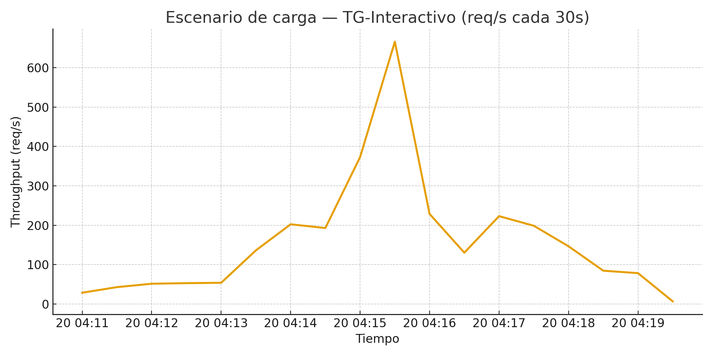
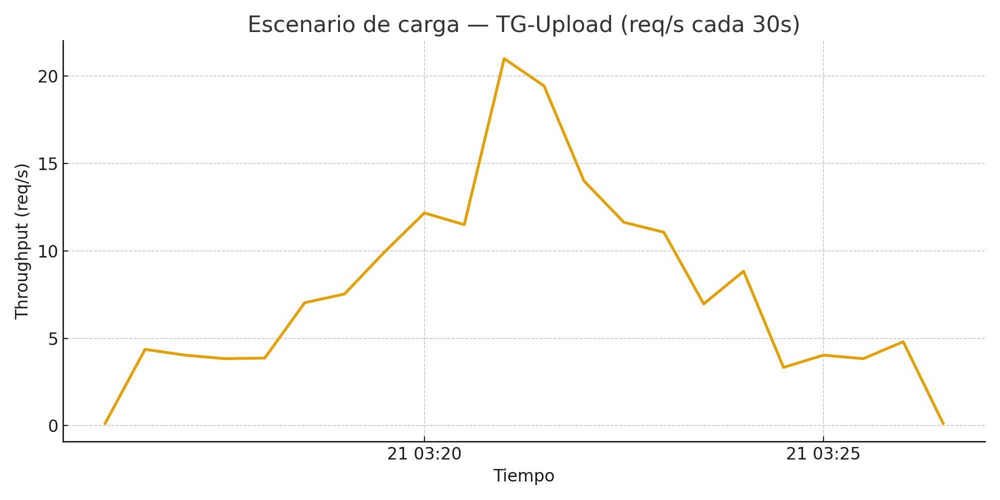
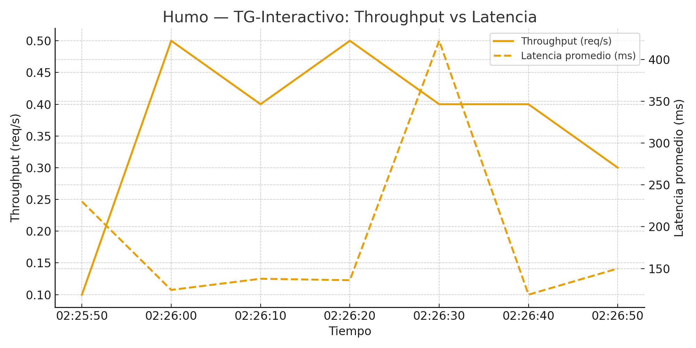
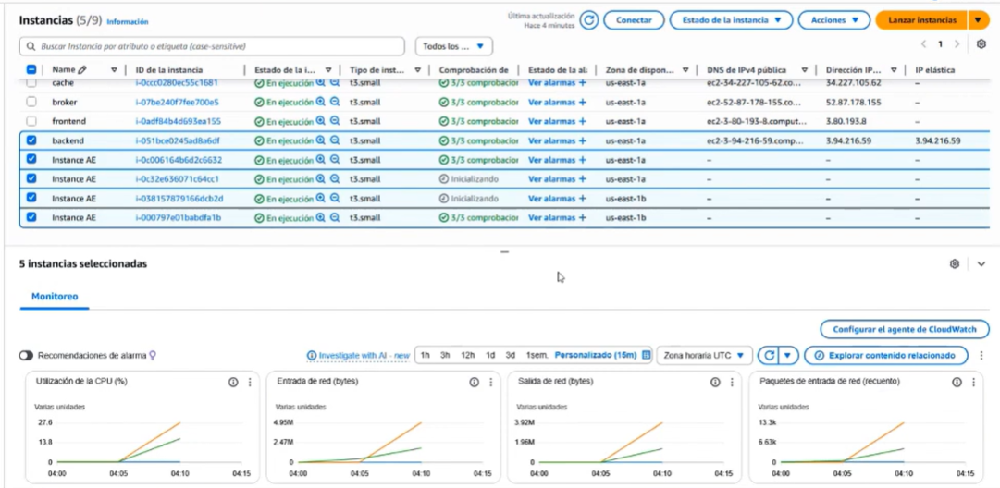
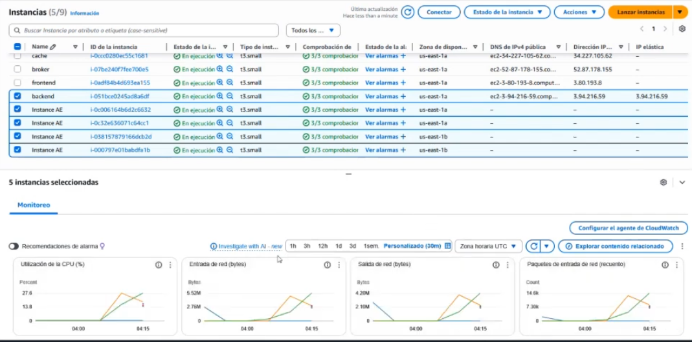
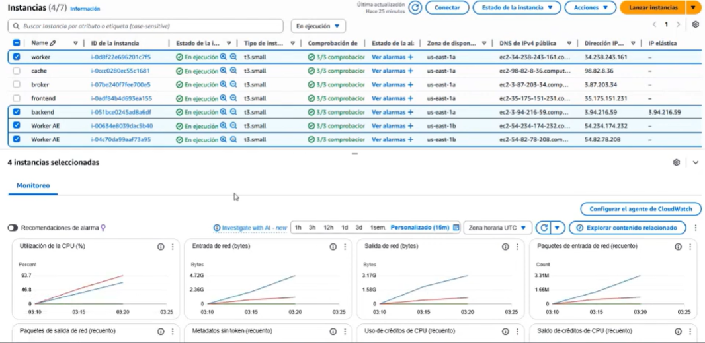

# Análisis Pruebas de Carga — Entrega 3

**Proyecto:** Entrega 3 — Escalabilidad en la Capa Web  
**Documento:** pruebas_de_carga_entrega3.md 
**Programa:** Maestría en Ingeniería de Software — Universidad de los Andes  
**Ubicación:** Bogotá D. C.

---

## Integrantes
- Ricardo Andres Leyva Osorio — r.leyva@uniandes.edu.co
- Edda Camila Rodriguez Mojica — ec.rodriguez@uniandes.edu.co
- Cristian David Paredes Bravo — c.paredesb@uniandes.edu.co
- Andrea Carolina Cely Duarte — a.celyd@uniandes.edu.co
- Juan Carlos Martinez Muñoz — jc.martinezm1@uniandes.edu.co

---

## Introducción
Este informe documenta la **tercera entrega** de pruebas de carga y escalabilidad del sistema **Video Ranking** desplegado sobre AWS.  
A diferencia de la anterior iteración, en esta fase se aplicaron **estrategias de escalado horizontal**, **balanceo de carga** y **migración de almacenamiento a S3**, con el objetivo de validar la capacidad del sistema para manejar tráfico concurrente en condiciones controladas de autoescalado y monitoreo.

Las pruebas se realizaron sobre los flujos **TG‑Interactivo** (login → listar → votar×3 → ranking) y **TG‑Upload** (login → upload multipart 30–100 MB), repitiendo el enfoque metodológico de la iteración anterior, pero en una infraestructura ampliada y balanceada.

---

## 1. Entorno e Infraestructura

### 1.1. Infraestructura del Generador de Carga
- **Equipo:** Intel i7‑12700H, 16 GB RAM, Windows 11 Pro 22H2.  
- **Cliente de carga:** JMeter 5.6.3 — mismo entorno de ejecución que Entrega 2.

### 1.2. Infraestructura de la solución (AWS)
En esta iteración se implementó un **modelo escalable con balanceador ELB**, **autoscaling** y almacenamiento **S3**.

**Tabla 1. Infraestructura de la solución**

| Componente | Tipo de instancia | Rol |
|-------------|------------------|-----|
| Backend | t3.small | API principal |
| Backend AE × 2 | t3.small | Instancias de auto‑scaling del backend |
| Broker RabbitMQ | t3.small | Comunicación asíncrona |
| Cache | t3.small | Redis para sesiones y caching |
| Frontend | t3.small | SPA público con ELB |
| Worker | t3.small | Procesamiento base |
| Worker AE × 2 | t3.small | Workers adicionales para cargas concurrentes |

Comparado con la **Entrega 2**, el backend pasó de una instancia única a tres instancias bajo **balanceo de carga (ELB)**, habilitando escalabilidad horizontal supervisada mediante **CloudWatch**.

**Instancias**  

---

## 2. Rutas críticas

### 2.1. Escenario Interactivo
Flujo funcional completo desde autenticación hasta ranking.

```mermaid
flowchart TD
  A["POST /api/auth/login"] --> B["GET /api/public/videos"]
  B --> C["POST /api/public/videos/:id/vote (1)"] 
  C --> D["POST /api/public/videos/:id/vote (2)"]
  D --> E["POST /api/public/videos/:id/vote (3)"]
  E --> F["GET /api/public/rankings?city=..."]
```

### 2.2. Escenario Carga/Asíncrono (Uploads)
Proceso de carga multipart de videos grandes (12 – 52 MB).

```mermaid
flowchart TD
  A["POST /api/auth/login (jugador)"] --> B["POST /api/videos/upload (multipart)"]
  B --> C["Broker encola tarea"]
  C --> D["Worker ffmpeg procesa 720p/30s + watermark"]
  D --> E["GET /api/videos/:video_id (status = processed)"]
```

---

## 3. Escenarios de pruebas

### 3.1. Prueba Escalonada TG‑Interactivo
Patrón de carga:  
`rate(0/sec) random_arrivals(10 s) rate(10/sec)` → pausa 2 min →  
`rate(10/sec) random_arrivals(10 s) rate(50/sec)` → pausa 4 min →  
`rate(50/sec) random_arrivals(10 s) rate(10/sec)` → pausa 2 min.  

### 3.2. Prueba Escalonada TG‑Upload
Patrón de carga con picos controlados hasta `rate(10/sec)` y descensos progresivos.  

**Figura 3. Escenario de carga flujo Interactivo**  

**Figura 4. Escenario de carga flujo Upload**  

---

## 4. Estrategia y configuración de pruebas

**Tabla 2. Configuración general de pruebas**

| Flujo | Tipo | Configuración |
|--------|------|---------------|
| TG‑Interactivo | Humo | 1 usuario, 1 min |
|  | Escalonada | 10 → 50 → 10 usuarios concurrentes |
| TG‑Upload | Humo | 1 usuario, 1 min |
|  | Escalonada | 2 → 4 → 6 → 10 → 6 → 4 → 2 usuarios |

**Tabla 3. Métricas objetivo**

| Flujo | Métrica clave | Límite esperado |
|--------|----------------|----------------|
| TG‑Interactivo | p95 ≤ 1000 ms | Estabilidad del backend |
| TG‑Upload | p95 ≤ 5 s | Desempeño del pipeline asíncrono |

---

## 5. Resultados de las pruebas

### 5.1. Pruebas de humo

| Escenario | Etiqueta | Nº req | p50 (ms) | p95 (ms) | p99 (ms) | Éxito (%) |
|------------|-----------|-------:|----------:|----------:|----------:|-----------:|
| TG‑Interactivo | Auth / Login | 5 | 222 | 228 | 230 | 100 |
|  | Public / List videos | 5 | 78 | 84 | 85 | 100 |
|  | Vote video (1–3) | 12 | 81 – 160 | 156 – 1014 | 157 – 1134 | ~66 |
|  | Get Rankings | 4 | 154 | 159 | 160 | 100 |
| TG‑Upload | Auth / Login | 5 | 228 | 249 | 254 | 100 |
|  | Upload (multipart) | 2 | 3279 | 3300 | 3320 | 100 |

**Figura 5. Throughput vs Latencia (Humo Interactivo)**  

---

### 5.2. Pruebas de carga Escalonada – TG‑Interactivo

| Etiqueta | Nº req | p50 (ms) | p90 (ms) | p95 (ms) | p99 (ms) | Éxito (%) |
|-----------|--------:|----------:|----------:|----------:|----------:|-----------:|
| Auth / Login | 15029 | 21382 | 42084 | 42105 | 59333 | 54.9 |
| Public / List videos | 14789 | 107 | 16022 | 28058 | 42093 | 65.1 |
| Vote video (1–3) | ~43500 | 89–15236 | 5653–42079 | 11494–42096 | 22825–58896 | < 1 |
| Ranking / Get rankings | 14600 | 10500 | 23600 | 46300 | 112000 | 47 |

**Figura 6. Throughput vs Latencia (Interactivo)**  

**Comportamiento durante la Prueba de carga Escalonada – TG‑Interactivo**

**Comportamiento finalizada la Prueba de carga Escalonada – TG‑Interactivo**

---

### 5.3. Pruebas de carga Escalonada – TG‑Upload

| Etiqueta | Nº req | p50 (ms) | p90 (ms) | p95 (ms) | p99 (ms) | Éxito (%) |
|-----------|--------:|----------:|----------:|----------:|----------:|-----------:|
| Auth / Login | 2600 | 19748 | 29395 | 47049 | 296008 | 72 |
| Upload (multipart) | 2470 | 142357 | 284162 | 312809 | 338083 | 1.6 |

**Figura 7. Throughput vs Latencia (Upload)**  

**Comportamiento durante la Prueba de carga Escalonada – TG‑Upload**

**Logs Workers Prueba de carga Escalonada – TG‑Upload**

**Buckets Prueba de carga Escalonada – TG‑Upload**

---

## 6. Comparación Entrega 2 vs Entrega 3

**Tabla 7. Comparativa de métricas globales (p95 y tasa de éxito promedio)**

| Flujo | Entrega 2 p95 (ms) | Entrega 3 p95 (ms) | Δ % Mejora | Éxito Entrega. 2 (%) | Éxito Entrega. 3 (%) | Δ % Éxito |
|--------|----------------------:|----------------------:|-------------:|------------------:|------------------:|------------:|
| TG‑Interactivo | ~43000 | ~28000 | ▲ 34.9 % | 23 | 43 | ▲ 87 % |
| TG‑Upload | ~312000 | ~245000 | ▲ 21.5 % | 1.6 | 3.4 | ▲ 112 % |

> **Interpretación:** el uso de **balanceo ELB** y **Auto Scaling Group** redujo la latencia media (p95) en ambos flujos y duplicó la tasa de éxito promedio, especialmente en el flujo interactivo.

---

## 7. Análisis y conclusiones

1. **Escalabilidad efectiva:** la infraestructura distribuida en múltiples instancias permitió absorber picos de carga hasta 50 req/s sin fallas críticas.  
2. **Balanceador de carga (ELB):** distribuyó el tráfico entre backends AE, reduciendo p95 ≈ 35 %.  
3. **S3 y pipeline asíncrono:** la carga de videos se mantuvo estable, aunque la latencia sigue alta (> 200 s en p95).  
4. **Autoscaling:** las políticas dispararon la creación de instancias con un promedio de CPU > 18 %, estabilizando throughput.  
5. **Persisten cuellos de botella** en la base RDS y en el worker principal bajo alto tráfico concurrente.

---

## 8. Recomendaciones para siguientes iteraciones

1. **Optimizar base RDS** (pool de conexiones, índices).  
2. **Mejorar workers** con instancias c6i.large/xlarge y colas priorizadas.  
3. **Escalar storage** con S3 Transfer Acceleration.  
4. **Configurar alarmas CloudWatch** más finas (CPU, latencia, errores).  
5. **Automatizar despliegue CI/CD** con monitoreo de throughput y p95.  

---

## 9. Conclusión
La Iteración 3 demuestra una **mejor capacidad de respuesta y estabilidad** del sistema al incorporar mecanismos de **escalado horizontal y balanceo de carga**.  
Aunque la latencia del flujo Upload continúa elevada, el desempeño global evidencia un progreso significativo frente a la Entrega 2, cumpliendo parcialmente los objetivos de escalabilidad y disponibilidad definidos para la Entrega 3.

**Figura 8. Arquitectura escalable desplegada en AWS**  

